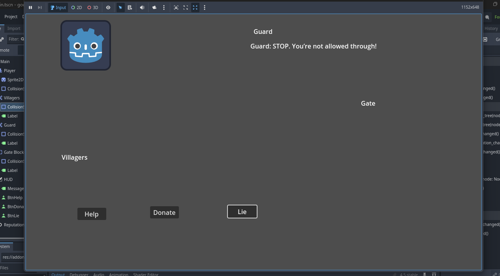
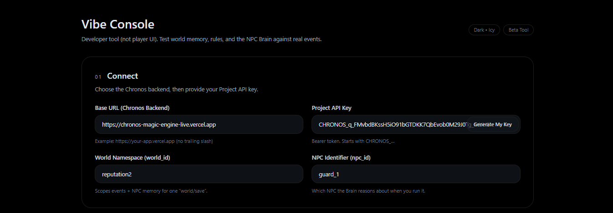
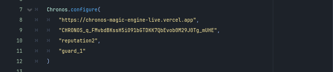
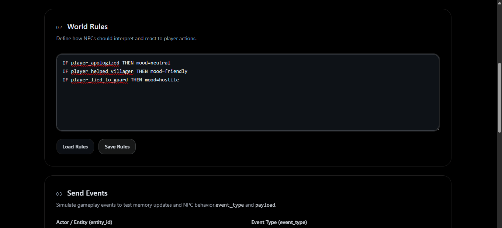
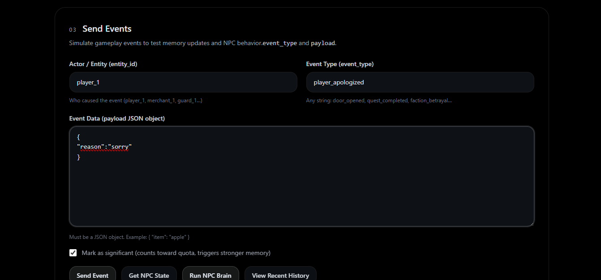

# Chronos Engine

**Persistent World Memory for Games**

NPCs in most games forget everything.  
Chronos gives your game world **memory**.

Chronos Engine is a backend service that provides:

- persistent NPC memory  
- evolving world state  
- AI-driven behavior  

Instead of NPCs resetting every session, Chronos stores **world events** and derives NPC behavior from that history.

Player actions become part of the world's memory, allowing characters to react consistently across play sessions.

---

# Overview

Chronos is like a **Magic Heart and a Living Mind** for video games.

Usually, characters in games are like actors who forget their lines as soon as you turn the game off.

Chronos gives them:

- **A Heart** → remembers their history forever  
- **A Mind** → thinks about those memories  

Example:

If you trick a guard today:

→ the **Heart remembers the lie**  
→ the **Mind processes the memory**  
→ the guard becomes **suspicious tomorrow**

Just plug Chronos into your game and the world begins to **learn, grow, and react like a living system**.

---

# What Chronos Does

Chronos stores **game events** and derives **NPC state** using rules and AI.

### Example Flow

```

Player steals from merchant
↓
Event stored in memory
↓
Chronos Brain processes memory
↓
Guard becomes suspicious
↓
NPC behavior changes

```

This creates **living worlds where actions have long-term consequences.**

---

# Architecture

Chronos uses a simple architecture designed for game engines.

```

Game Engine
│
▼
Chronos SDK
│
▼
Chronos API
│
▼
World Event Memory
│
▼
Chronos Brain
│
▼
NPC State
│
▼
Game reacts

```

Chronos stores every **significant action** as a world event, then derives the current NPC state from that history.

This architecture enables:

- persistent NPC memory  
- consistent world behavior  
- long-term player consequences  

---

# Demo



Watch the live demo:

https://chronos-magic-engine-live.vercel.app/demo/0.1v

### Demo Flow

```

Player performs an action
↓
Event stored in Chronos
↓
Chronos Brain processes memory
↓
NPC state updates
↓
NPC behavior changes
↓
Restart the game
↓
NPC still remembers

```

---

# Quick Start

## 1. Install SDK

Copy the Godot SDK into your project:

```

res://addons/chronos/

```

Files:

```

Chronos.gd
ChronosRESTClient.gd
ChronosSSEClient.gd
ChronosTypes.gd

```

Enable the plugin in:

```

Project Settings → Plugins

````

---

## 2. Get your Chronos credentials

Create a world in the Chronos Vibe Console and copy your credentials.



You will need:


API Key

World ID

NPC ID


Use them in your configuration:

## 3. Configure Chronos

```gdscript
Chronos.configure(
"https://chronos-engine.vercel.app",
"CHRONOS_API_KEY",
"your_world_id",
"npc_id"
)

Chronos.start()

````
Example Setup Scean.



---

# Recommended SDK Flow (0.1v)

Your game only needs to:

* send gameplay events
* listen for NPC state updates

Chronos will automatically:

* run the Brain
* update NPC state
* push real-time updates back to the game

---

## Important Call 1 — Listen for NPC state updates

When Chronos updates an NPC’s state, your game listens for the update and reacts to the new behavior.

```gdscript
Chronos.npc_state_updated.connect(_on_npc_state_updated)
```

Example:

```gdscript
func _on_npc_state_updated(row):
    var npc_id = row["npc_id"]
    var state = row["state"]

    print("NPC state updated:", npc_id, state)
```

Real game example:

```gdscript
func _on_npc_state_updated(row):
    var state = row["state"]

    if state["mood"] == "hostile":
        guard_attack_player()

    if state["mood"] == "friendly":
        guard_allow_entry()
```

Your game reacts to NPC behavior changes here.


## Important Call 2 — Send gameplay events

When something important happens in your game, send it to Chronos.

```gdscript
Chronos.append_event(
  "player_1",
  event_type,
  payload,
  true
)
```

Example:

```gdscript
Chronos.append_event(
  "player_1",
  "player_lied_to_guard",
  {"context":"conversation"},
  true
)
```

Chronos will automatically:

* store the event
* run the Brain
* update NPC state
* push the update back to the game

---

## Optional Call — Load NPC state on startup

If a scene loads after a restart, fetch the saved NPC state once.

```gdscript
Chronos.get_npc_state("guard_1")
```

This ensures the NPC immediately reflects the saved world state.

---

## Manual Debug Calls

```gdscript
Chronos.append_event(
"player_1",
"player_lied_to_guard",
{"context":"conversation"},
true
)

Chronos.brain_think(50)

Chronos.get_npc_state("guard_1")
```

---

# Example Project

See the full working demo:

[https://github.com/enginechronos/chronos-demo]

The demo shows:

* Godot integration
* gameplay events
* NPC mood changes
* persistent world memory

---

# API Basics

Chronos works with three core endpoints.

## Append Event

```
POST /api/events/append
```

Example:

```json
{
  "world_id": "village",
  "entity_id": "player_1",
  "event_type": "player_stole",
  "payload": {"npc":"merchant"},
  "significant": true
}
```

---

## Run Brain

```
POST /api/brain/think
```

---

## Fetch NPC State

```
GET /api/npc/state
```

Full documentation:

[https://chronos-magic-engine-live.vercel.app/docs]

---

# Vibe Console

Chronos includes a developer tool called the **Vibe Console**.

This allows developers to:

* inject events
* edit world rules
* inspect NPC state
* debug memory

You don’t need to change game code every time.

Adjust behavior directly from the console and NPCs will react immediately — no redeploy required.

Design NPC behavior **live while the game is running.**

---

### World Rule Editor



### NPC Event Debugging



Without changing your game code, Chronos becomes a **live AI behavior control system** for your world.

---

# Engine Support

### Current

* Godot 3.6 SDK

### Planned

* Unity SDK
* Unreal Engine SDK
* JavaScript SDK

Chronos is designed to be **engine agnostic**.

---

# Why Chronos Exists

Most games reset NPC behavior every session.

Players may:

* steal
* lie
* attack
* help characters

But NPCs forget those actions when the game reloads.

Chronos solves this by giving game worlds **persistent memory**.

Every significant player action becomes part of the world's history, allowing NPCs to react consistently over time.

---

# Roadmap

Upcoming work includes:

* improved runtime streaming
* Unity SDK
* multi-NPC world simulations
* deeper AI behavior systems
* advanced world orchestration

Chronos aims to become the **memory layer for living game worlds.**

---

# Community

Discord:

[https://discord.gg/pY5qTNAWV6]

---

# License

MIT License

